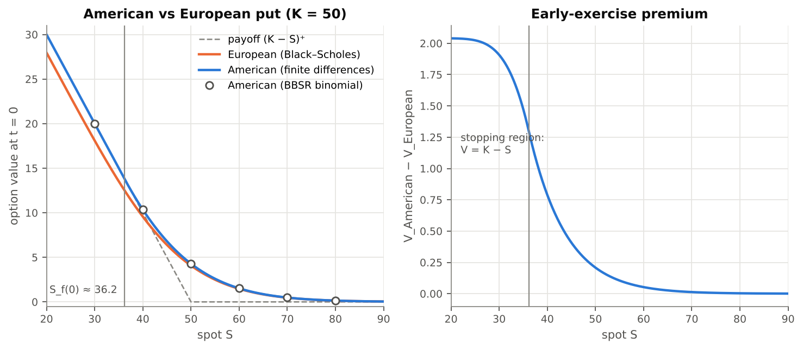
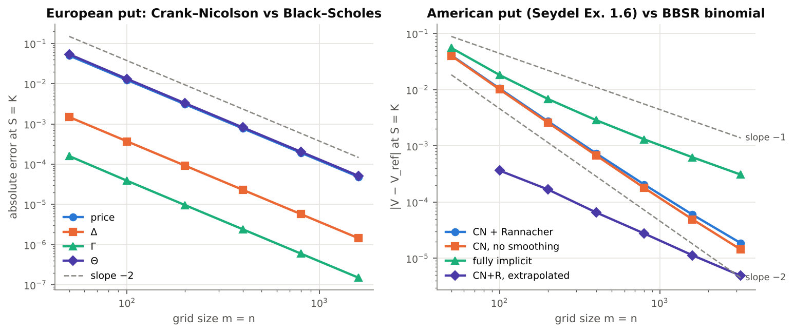
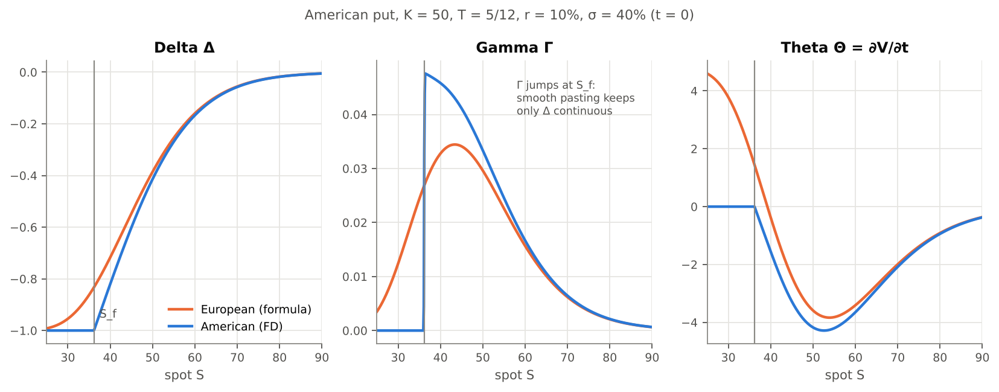
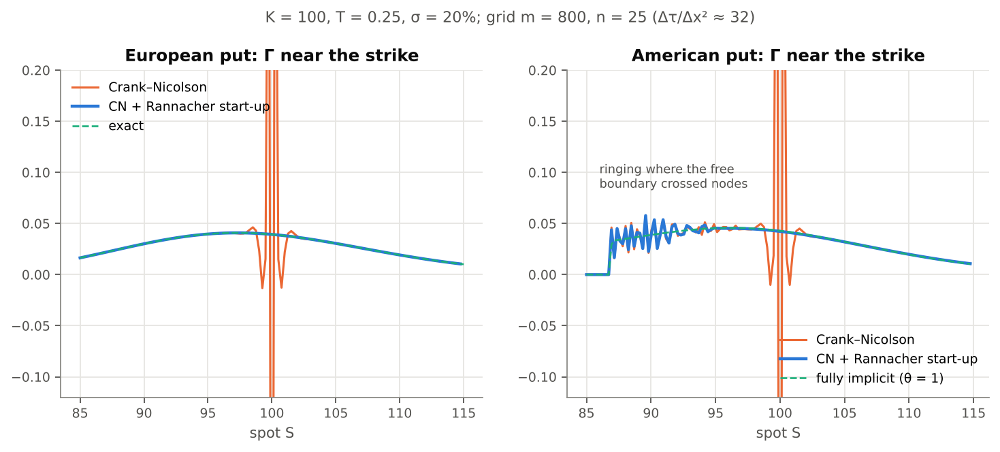
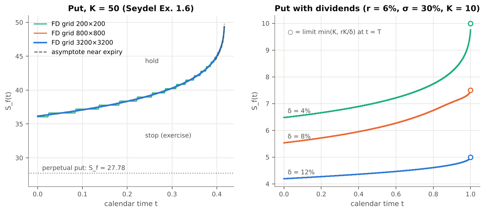
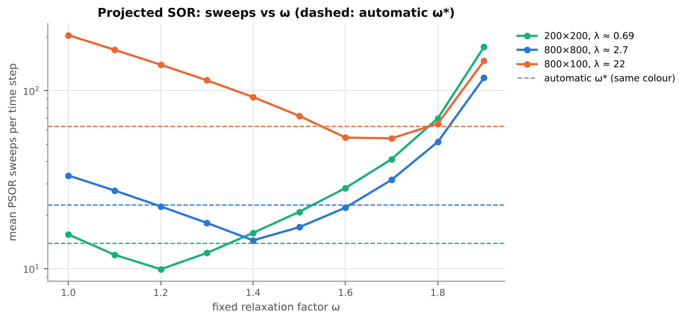

# American options by finite differences

[](https://github.com/TheFiniks/american-option-fd/actions/workflows/tests.yml)

Numerical solution of the Black–Scholes equation with the **Crank–Nicolson** scheme;
**early exercise** of an American option treated as a **free-boundary problem**, written as
a linear complementarity problem and solved by **projected SOR (PSOR)**. Verified by a
grid-convergence study, against binomial trees and the Black–Scholes formula, with the
Greeks **Δ, Γ, Θ** computed on the grid.



## Highlights

- Reproduces **Seydel's Table 4.1 to all eight printed digits** under his settings (test
  `test_reproduces_seydel_table_4_1`).
- **European options: clean second order** for price, Δ, Γ and Θ (observed order 2.00 on
  grids up to 1600 × 1600).
- **American put** agrees with a high-accuracy binomial reference (BBSR, N = 40 000) to
  1.9 · 10⁻⁵ on a 3200 × 3200 grid, 4.9 · 10⁻⁶ after Richardson extrapolation.
- PSOR and the direct **Brennan–Schwartz** solver agree to better than 10⁻⁷; PSOR picks its
  relaxation factor automatically.
- **Rannacher start-up** removes the spurious Γ oscillations of plain Crank–Nicolson
  (Γ error 0.83 → 1.7 · 10⁻⁵ in the test case below).
- 44 tests: analytic formulas, put–call parity and symmetry, smooth pasting, the perpetual
  put limit, LCP complementarity.

## Method

### 1. From Black–Scholes to the heat equation

With a continuous dividend yield δ the option value $V(S,t)$ solves

$$
\frac{\partial V}{\partial t} + \tfrac12\sigma^2 S^2 \frac{\partial^2 V}{\partial S^2}+ (r-\delta) S\frac{\partial V}{\partial S} - rV = 0 .
$$

Following Seydel (§4.1) we substitute

$$
S = Ke^{x},\quad t = T - \frac{2\tau}{\sigma^2},\quad
V = K\,e^{-a x - b\tau}\,y(x,\tau),\qquad
a = \tfrac12(q_\delta-1),\ b = a^2+q,\ q=\tfrac{2r}{\sigma^2},\ q_\delta=\tfrac{2(r-\delta)}{\sigma^2},
$$

which gives $y_\tau = y_{xx}$: constant coefficients, time running forward from expiry.
The uniform $x$-grid is a geometric grid in $S$, and the strike is always a grid node.

### 2. θ-scheme and Crank–Nicolson

On a uniform grid $x_i$, $\tau_\nu$ with $\lambda = \Delta\tau/\Delta x^2$:

$$
(1+2\lambda\theta)\,w_i^{\nu+1} - \lambda\theta\,(w_{i-1}^{\nu+1}+w_{i+1}^{\nu+1}) = w_i^{\nu} + \lambda(1-\theta)\,(w_{i-1}^{\nu}-2w_i^{\nu}+w_{i+1}^{\nu}).
$$

θ = ½ is Crank–Nicolson (second order in Δx and Δτ, unconditionally stable), θ = 1 fully
implicit (first order in time). Boundary values at the truncated ends come from the
put–call-parity asymptotics; for American options $\max(\text{European asymptote}, \text{payoff})$.

### 3. Early exercise: linear complementarity

An American option must satisfy $V \ge$ payoff everywhere, with the Black–Scholes equation
holding where $V >$ payoff and an inequality where $V =$ payoff (Seydel §4.5). In the
transformed variables, with obstacle $g$ = transformed payoff, each time step is the LCP

$$
A w \ge b,\qquad w \ge g,\qquad (Aw-b)^{\top}(w-g) = 0 .
$$

The free boundary $S_f(t)$ never appears explicitly; it is read off afterwards as the edge of
the set where $w = g$.

**Projected SOR** (Cryer 1971, Seydel Alg. 4.13) is SOR with a projection after each update:

$$
w_i \leftarrow \max\Bigl(g_i,\; w_i + \omega\bigl(\tfrac{b_i - \sum_{j\ne i} a_{ij}w_j}{a_{ii}} - w_i\bigr)\Bigr),
$$

warm-started from the previous time level. The relaxation factor defaults to Young's optimum
for the tridiagonal matrix, $\omega^* = 2/(1+\sqrt{1-\mu^2})$ with
$\mu = 2\lambda\theta\cos(\pi/m)/(1+2\lambda\theta)$.

**Brennan–Schwartz** (1977) is the direct alternative: Gaussian elimination ordered so that
back-substitution starts in the exercise region, with the projection applied on the way.
Exact for vanilla puts and calls (one contiguous exercise region), O(m) per step. It is used
as an independent check of PSOR and for the large convergence runs.

### 4. Rannacher start-up

The payoff kink at the strike excites high-frequency modes that Crank–Nicolson damps only
weakly (it is A-stable, not L-stable). The first two Crank–Nicolson steps are therefore
replaced by four fully implicit half-steps (Rannacher 1984; Giles & Carter 2006), which keeps
second-order convergence.

### 5. Greeks

On the final time level, in the original variables:

- **Δ, Γ** by three-point formulas on the non-uniform $S$-grid (exact for linear $V$, so
  Δ = −1 and Γ = 0 hold to round-off in the stopping region);
- **Θ = ∂V/∂t** by a second-order one-sided difference over the last three time levels.

## Results

All numbers below are regenerated by `python scripts/run_all.py`; full tables are in
[`results/`](results/).

### Grid convergence



| m = n | European put: price error | order | American put: error (CN + Rannacher) | order | extrapolated |
|---:|---:|---:|---:|---:|---:|
| 100 | 1.24e-02 | 2.01 | 1.05e-02 | 1.96 | 3.65e-04 |
| 200 | 3.09e-03 | 2.00 | 2.76e-03 | 1.93 | 1.68e-04 |
| 400 | 7.73e-04 | 2.00 | 7.39e-04 | 1.90 | 6.56e-05 |
| 800 | 1.93e-04 | 2.00 | 2.05e-04 | 1.85 | 2.76e-05 |
| 1600 | 4.83e-05 | 2.00 | 5.98e-05 | 1.78 | 1.13e-05 |
| 3200 | — | — | 1.86e-05 | 1.68 | 4.91e-06 |

European: K = S = 100, T = 0.5, r = 5 %, σ = 25 %, δ = 2 %. American: Seydel's Example 1.6
(K = S = 50, T = 5/12, r = 10 %, σ = 40 %), reference V = 4.2842160 (BBSR, N = 40 000).

The American order drifts from 2 towards 1.7 on fine grids: across the free boundary $V$ is
only $C^1$ (Γ jumps), which caps the accuracy of a fixed grid (Seydel §4.5.3; Forsyth & Vetzal
2002). The fully implicit scheme converges with order 1, as expected
([`results/convergence.md`](results/convergence.md)).

### Finite differences vs binomial vs Black–Scholes

| S | FD (800×800) | BBSR binomial | CRR (N = 1000) | European (BS) | early-exercise premium |
|---:|---:|---:|---:|---:|---:|
| 40 | 10.348475 | 10.348583 | 10.348796 | 9.559921 | 0.788554 |
| 45 | 6.805524 | 6.805703 | 6.806575 | 6.397860 | 0.407664 |
| 50 | 4.284011 | 4.284218 | 4.283627 | 4.075981 | 0.208030 |
| 55 | 2.594437 | 2.594624 | 2.594965 | 2.489512 | 0.104925 |
| 60 | 1.520833 | 1.520978 | 1.521035 | 1.468410 | 0.052423 |

Same option. Puts and calls with dividends, including Seydel's Fig. 4.9 call
(V(K, 0) = 2.18728), are in [`results/comparison.md`](results/comparison.md).

### Greeks



At S = K the FD Greeks match the Black–Scholes formulas (European) to 10⁻⁶–10⁻⁴ and a
bump-and-reprice binomial estimate (American) to the accuracy of that estimate
([`results/greeks.md`](results/greeks.md)). The American Γ jumps at $S_f$ while Δ stays
continuous: that is the smooth-pasting condition $\partial V/\partial S(S_f) = -1$.

### Why Rannacher start-up matters



With a large ratio Δτ/Δx² plain Crank–Nicolson produces Γ values of the wrong sign at the
strike. Rannacher start-up removes them for the European put. For the American put a second
source of oscillation remains: every time the free boundary crosses a grid node it creates a
new local kink, which Crank–Nicolson again damps poorly. The fully implicit scheme is smooth
but first order. Keeping Δτ/Δx² moderate removes the problem: already at Δτ/Δx² ≈ 2 the
Crank–Nicolson Γ is as smooth as the implicit one (test
`test_free_boundary_ringing_needs_moderate_lambda`).

### Early-exercise boundary



Left: $S_f(t)$ for Seydel's Example 1.6 on three grids: the step function refines towards a
smooth curve, follows the near-expiry asymptote
$S_f \sim K\bigl(1-\sigma\sqrt{(T-t)\,\lvert\ln(T-t)\rvert}\bigr)$ and stays above the
perpetual level $Kq/(1+q)$. Right: the analogue of Seydel's Fig. 4.7. With dividends the
boundary starts at $\min(K, rK/\delta)$ at expiry.

### PSOR relaxation factor



With a warm start no fixed ω is good on every grid: 1.2–1.4 is best for moderate λ but slow
for large λ, and ω = 1 (Gauss–Seidel, Seydel's suggestion) is the slowest everywhere. Young's
ω* stays within a factor of about 1.6 of the best fixed value and is the default.

## Usage

```bash
git clone https://github.com/TheFiniks/american-option-fd.git
cd american-option-fd
python -m venv .venv && source .venv/bin/activate   # Windows: .venv\Scripts\activate
pip install -e ".[dev,fast]"                         # fast = numba JIT for the PSOR loop
pytest                                               # 44 tests
python scripts/run_all.py                            # regenerate results/ and figures/
```

```python
from americanfd import Option, solve_fd, bs_price, binomial_price

opt = Option(K=50.0, T=5/12, r=0.10, sigma=0.40, kind="put", style="american")
res = solve_fd(opt, m=800, n=800)          # Crank–Nicolson + Rannacher + PSOR

res.price(50.0)                            # 4.28401
g = res.greeks(50.0)                       # g.delta -0.41398, g.gamma 0.03336, g.theta -4.1743
res.exercise_boundary_t0                   # S_f(0) ≈ 36.19 (grid point)
res.boundary_t, res.boundary_S             # the whole curve S_f(t)

binomial_price(50.0, opt, n=10_000)        # BBSR reference: 4.28422
bs_price(50.0, opt)                        # European value: 4.07598
```

Main options of `solve_fd`: `theta` (0.5 = Crank–Nicolson, 1 = implicit), `lcp`
(`"psor"` or `"brennan-schwartz"`), `rannacher` (number of smoothed start-up steps),
`half_width` (x-range, default 6σ√T + drift), `omega` (PSOR factor, default automatic),
`store_surface` (keep V(S, t) on all levels).

Without numba everything still works on pure Python; the 3200 × 3200 runs then take
seconds with Brennan–Schwartz and minutes with PSOR.

## Repository layout

```
src/americanfd/
  option.py          contract and market parameters
  black_scholes.py   closed-form prices and Greeks, perpetual American put
  binomial.py        CRR, BBS and BBSR trees (reference values)
  lcp.py             projected SOR, Brennan–Schwartz, Thomas; optimal omega
  fd.py              heat-equation transform, theta-scheme, Rannacher, Greeks, S_f(t)
tests/               pytest suite
scripts/             convergence study and figures -> results/*.md, figures/*.png
```

## Pitfalls found along the way

- **Grid width.** Seydel's fixed x ∈ [−5, 5] wastes nodes for short-dated options: on Example
  1.6 its error on the same grid is 7–10× larger than with x ∈ ±(6σ√T + drift). The opposite holds for
  long-dated puts, whose value decays only like a power of S: with T = 100 the right boundary
  must be far out, or the V = 0 condition there biases the price.
- **Greeks on a log-grid.** Central differences in x give Δ = −1.00001 in the stopping region.
  Three-point formulas directly in S are exact there.
- **PSOR stopping rule.** The transformed variable y spans many orders of magnitude, so the
  tolerance is relative (10⁻¹²). PSOR and Brennan–Schwartz then agree to better than 10⁻⁷.
- **American calls without dividends** are never exercised early. The solver returns the
  European value and an empty exercise boundary, which a test checks.

## References

1. R. U. Seydel, *Tools for Computational Finance*, 4th ed., Springer 2009, ch. 4 (the
   transformation, θ-scheme, LCP formulation, PSOR, Algorithm 4.13 and Table 4.1).
2. А. Н. Ширяев, *Основы стохастической финансовой математики*, т. 2, гл. VIII §1–3
   (Black–Scholes formula, optimal stopping and the Stefan problem for American options).
3. P. Wilmott, S. Howison, J. Dewynne, *The Mathematics of Financial Derivatives*, CUP 1995.
4. C. W. Cryer, The solution of a quadratic programming problem using systematic
   overrelaxation, *SIAM J. Control* 9 (1971).
5. M. J. Brennan, E. S. Schwartz, The valuation of American put options, *J. Finance* 32 (1977).
6. R. Rannacher, Finite element solution of diffusion problems with irregular data,
   *Numer. Math.* 43 (1984).
7. M. B. Giles, R. Carter, Convergence analysis of Crank–Nicolson and Rannacher time-marching,
   *J. Comput. Finance* 9 (2006).
8. M. Broadie, J. Detemple, American option valuation: new bounds, approximations, and a
   comparison of existing methods, *Rev. Financial Studies* 9 (1996).
9. P. A. Forsyth, K. R. Vetzal, Quadratic convergence for valuing American options using a
   penalty method, *SIAM J. Sci. Comput.* 23 (2002).

## License

MIT
